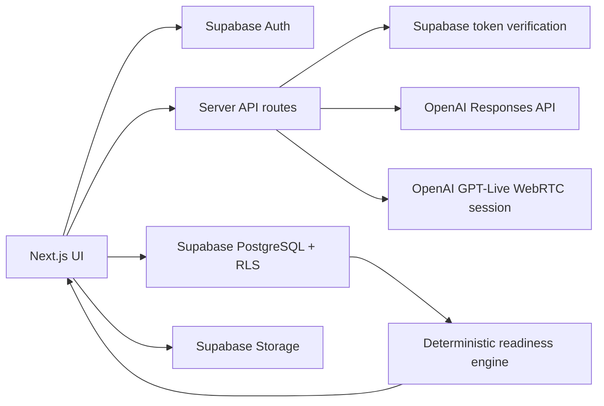

# PLACEMENT PREP BY HRU'S

> Learn. Build. Prove. Get Hired.

PLACEMENT PREP BY HRU'S is an AI Career Operating System for Electronics & Telecommunication, Electronics & Communication, and Electronics Engineering students. It turns a student’s role, deadline, available time, current skills, progress and evidence into a realistic next action.

The product is designed around one recurring question: **“What should I do next, and how will I know I have learned it?”**

## Product overview

The platform guides a student through:

Career Discovery → Foundations → Skill Building → Projects → Skill Verification → Portfolio → Resume → Aptitude → Interview Preparation → Applications → Placement Readiness → First 90 Days

The current build includes a complete credential-free demo experience and production adapters for Supabase and OpenAI. Demo state is clearly labelled and follows the same product interfaces used by live services.

## Features

- Premium responsive landing page, light/dark themes and configurable brand constants
- Login, signup, logout, password reset and protected application routes
- Five-step onboarding for academics, goals, deadlines, time, learning preferences and current skills
- Role-first career discovery across Embedded, IoT, RF, Radar, VLSI, Signal Processing, Automation, Robotics, Software and AI + Electronics
- Goal-generated roadmap charts with ENTC/ECE track matching, prerequisite bridges, deadlines and milestone criteria
- Today’s Mission with exact time budgeting, start, pause, complete, skip, reschedule, focus timer and adaptive carry-forward
- AI mentor prompt supporting daily through annual planning contexts
- Project Builder with hardware, software, protocols, power, cost caveats, milestones, failure handling, testing and evidence
- My Engineering Journey, connecting the current goal, milestone, learning task, project, evidence, interview practice and next action without duplicating records
- Build With What I Have inventory for exact models, quantities, condition, tools, power supplies and simulation software, with reviewed-template matching and explicit missing equipment
- Reversible Today Changed planning that preserves completed work, shows moved tasks and reports deadline risk instead of hiding it
- Project workspaces with reviewed template source/revision/compatibility, safe connection gates, test checklists, debugging trees and a functional Prove It evidence workflow
- Evidence statuses kept distinct across Submitted, AI-reviewed, Revision requested and Mentor-reviewed; readiness uses de-duplicated transparent weighting
- Career trial activities for RF, Embedded, Signal Processing, VLSI and Automation, with saved reflection feeding transparent fit suggestions
- Evidence-grounded README, resume, portfolio, LinkedIn and interview drafts shown for review before any export
- Milestone-specific learning references with a structured NPTEL course, a practical YouTube option and an optional Udemy path, plus cost, level, duration, language and verification details
- Technical and aptitude assessments with scores, explanations and revision recommendations
- Adaptive 15-day interview journey with saved sessions, project-specific questions, honest retries, structured feedback and confidence trends
- Real GPT-Live voice interviews over WebRTC with microphone input, spoken questions, live captions, speaking/listening animation, call duration, mute/repeat/end controls, optional private camera self-view and text fallback
- Company-specific PDF/DOCX or PNG/JPG/WebP resume upload that reads content privately in the background, uses bundled English OCR for images, inspects document structure, applies a deterministic role-alignment rubric, suggests truthful wording and saves chosen versions
- Resume version tracker with per-company score changes, supplied-job keyword gaps and export-ready portfolio content
- Application tracker with validated official apply links, five monitored public company feeds, duplicate-safe tracking, foreground browser alerts, pipeline statuses and First 90 Days mode after an offer
- Explainable Placement Readiness and Interview Readiness scores based on stored progress—not hiring probability
- Normalized Supabase PostgreSQL schema with indexes, triggers, ownership policies and RLS
- Server-side OpenAI Responses API with strict Structured Outputs, caching and request throttling

## Screenshots

Add release screenshots to `docs/screenshots/` using these names:

- `landing-desktop.png`
- `dashboard-desktop.png`
- `dashboard-mobile.png`
- `project-builder.png`
- `interview-confidence-mode.png`

The generated launch card is available at `public/og.png`.

## Architecture



### Design principles

- Use deterministic application code for CRUD, timers, status changes, streaks, progress and readiness calculations.
- Use GPT-6 Astra only for reasoning-heavy plans, explanations, generation and evaluation.
- Use Structured Outputs for every AI response consumed by application code.
- Keep all OpenAI and Supabase service-role credentials server-side.
- Treat current jobs, hiring processes, course prices and deadlines as live information that must be verified.
- Preserve student agency: no guilt, fear, shame, manipulative streaks or invented achievements.

## Tech stack

- Next.js 16, React 19 and TypeScript
- Tailwind CSS 4 with reusable shadcn-style component primitives
- Supabase PostgreSQL, Auth and Row Level Security
- OpenAI Responses API with `gpt-6-astra`
- OpenAI GPT-Live with `gpt-live-1` plus a Responses reasoning backend
- Zod input validation
- Vercel deployment target

## Folder structure

```text
app/
  api/ai/                    Structured AI planning endpoint
  api/realtime/session/      Authenticated GPT-Live WebRTC session endpoint
  api/resume/extract/        Authenticated, size-limited resume text extraction
  career-discovery/          Career exploration route
  dashboard/                 Career OS dashboard
  journey/                   Unified My Engineering Journey
  interview/                 Confidence-first interview prep
  jobs/                      Application tracker
  onboarding/                Multi-step profile onboarding
  projects/                  Project Builder
  projects/[id]/             Evidence and implementation workspace
  quiz/                      Technical and aptitude assessments
  resources/                 Verified learning resources
  resume/                    Resume, JD-gap and portfolio tools
  roadmap/                   Adaptive roadmap and skill tree
components/                  Product pages, app shell and UI primitives
lib/                         Brand, demo data, readiness, Supabase and server utilities
public/                      Brand and interviewer assets
supabase/migrations/         Production PostgreSQL schema and RLS
supabase/seed.sql            Career-track, skill and dependency seed data
tests/                       Render, security and schema checks
```

## Setup

### Prerequisites

- Node.js 22.13 or newer
- npm
- Optional: a Supabase project and OpenAI API key

### Local installation

```bash
npm install
cp .env.example .env.local
npm run dev
```

Open `http://localhost:3000`.

On Windows PowerShell, use:

```powershell
Copy-Item .env.example .env.local
npm.cmd run dev
```

## Environment variables

| Variable | Visibility | Purpose |
| --- | --- | --- |
| `NEXT_PUBLIC_APP_URL` | Browser-safe | Canonical application URL |
| `NEXT_PUBLIC_SUPABASE_URL` | Browser-safe | Supabase project URL |
| `NEXT_PUBLIC_SUPABASE_ANON_KEY` | Browser-safe | Supabase anonymous key protected by RLS |
| `NEXT_PUBLIC_USE_MOCK_SERVICES` | Browser-safe | `true` enables the credential-free demo adapter |
| `SUPABASE_URL` | Server | Supabase project URL for token validation |
| `SUPABASE_ANON_KEY` | Server | Anonymous key for server token validation |
| `SUPABASE_SERVICE_ROLE_KEY` | Server secret | Privileged maintenance jobs only; never use in browser code |
| `OPENAI_API_KEY` | Server secret | Responses and GPT-Live API calls |
| `OPENAI_REASONING_MODEL` | Server | Defaults to `gpt-6-astra` |
| `OPENAI_LIVE_MODEL` | Server | Defaults to `gpt-live-1` |
| `OPENAI_LIVE_VOICE` | Server | Defaults to `marin` |
| `SAFETY_HASH_SALT` | Server secret | Salts privacy-preserving voice safety identifiers |

## Supabase setup

1. Create a new Supabase project.
2. Open the SQL editor and run every file in `supabase/migrations/` in filename order.
3. Run `supabase/seed.sql`.
4. Copy the project URL and anonymous key into `.env.local`.
5. Keep the service-role key only in server-side environment configuration.
6. Configure the site URL and allowed redirect URLs for local development and the production domain.
7. Set `NEXT_PUBLIC_USE_MOCK_SERVICES=false` after validating signup, email confirmation and password reset.

The migrations create all product tables, timestamps, foreign keys, indexes, update triggers, a profile-on-signup trigger, RLS policies, atomic roadmap persistence, task status history, adaptive interview-session persistence, confidence logs, and server-side validation. The connected-journey migration adds equipment, build preferences, reviewed templates, evidence/reviews, role explorations, reversible plan adjustments, explicit mentor authorization and integration permission records. The resume tracker extends `resume_versions` with company, application, source filename, transparent role-alignment score and review-source fields. Evidence files use a private owner-scoped Storage bucket with MIME and size limits. User-owned rows require `auth.uid() = user_id`; profiles require `auth.uid() = id`. Shared reviewed catalogs are read-only for authenticated users.

## OpenAI setup

1. Create an OpenAI API key in the OpenAI Platform.
2. Add `OPENAI_API_KEY` to `.env.local` and the server environment in production.
3. Keep `OPENAI_REASONING_MODEL=gpt-6-astra` unless intentionally testing another supported model.
4. The server sends strict JSON Schema through the Responses API and rejects invalid input before calling the model.
5. The current in-process cache avoids repeating identical planning calls for 15 minutes.

For production scale, replace the in-process request limiter and cache with a shared service such as Vercel KV/Redis so limits apply across instances.

## Realtime voice setup

The endpoint at `app/api/realtime/session/route.ts` accepts the browser's SDP offer and creates a GPT-Live WebRTC session server-side. The standard API key never reaches the browser. The session uses a Responses reasoning backend to select grounded follow-up questions from fundamentals through advanced engineering scenarios.

1. Configure `OPENAI_API_KEY`, `OPENAI_LIVE_MODEL=gpt-live-1`, `OPENAI_LIVE_VOICE=marin` and `OPENAI_REASONING_MODEL=gpt-6-astra`.
2. Confirm the OpenAI project has access to the configured Live and Responses models.
3. Serve the site over HTTPS in production; localhost is suitable for development microphone access.
4. Keep the user safety identifier server-generated and privacy-preserving.
5. Test microphone and camera denial, speaker autoplay blocking, network failure, quota limits, mute/unmute, local camera preview, graceful close and text fallback.

The browser streams microphone and speaker audio over WebRTC, receives separate student/interviewer transcript deltas, and copies the student transcript into the editable answer field. The optional camera is a local mirrored self-view only: its video track is never attached to the OpenAI peer connection or uploaded by this workflow. Maya's still image uses subtle state-driven animation and is accurately labeled as an animated AI interviewer, not a photorealistic lip-synced human. Demo mode does not fake a successful voice session: without valid credentials it reports that voice is not configured and keeps text mode functional.

## Testing

```bash
npm run typecheck
npm run lint
npm test
npm run build:vercel
```

`npm test` builds the production Next.js application, tests goal-to-roadmap generation and exact time budgets, validates adaptive interview advance/repeat logic, checks prerendered routes, verifies the complete schema and RLS declarations, confirms server-only secret naming, and validates the generated brand assets.

Critical product flows to verify before a release:

1. Signup → onboarding → dashboard
2. Login → protected route → logout
3. Career discovery → role selection → roadmap generation
4. Today’s Mission task completion, pause and focus timer
5. Project generation → save → milestone evidence
6. Inventory create/edit → reviewed template match → missing-equipment explanation
7. Today Changed preview → apply → completed-work preservation → undo
8. Project workspace → evidence submission → status/limitations → career-output draft
9. Career trial → reflection → suggestion refinement without track exclusion
10. Technical and aptitude quiz → score → revision recommendation
11. Confidence Mode → text answer → feedback → retry → confidence log
12. Realtime voice permission denied, connection failure and text fallback
13. Resume upload/extraction → company-specific review → explicit save → version comparison
14. Application creation, status change and Offer → First 90 Days

## Deployment

### Vercel

1. Push the repository to GitHub, GitLab or Bitbucket.
2. Import it into Vercel.
3. `vercel.json` runs the standard Next.js production build.
4. Add the environment variables from `.env.example` in Vercel project settings.
5. Set `NEXT_PUBLIC_APP_URL` to the final HTTPS URL.
6. Add the production URL to Supabase Auth redirect allowlists.
7. Run smoke tests before setting `NEXT_PUBLIC_USE_MOCK_SERVICES=false`.

Do not place `OPENAI_API_KEY` or `SUPABASE_SERVICE_ROLE_KEY` in any `NEXT_PUBLIC_*` variable.

## Security notes

- All AI and voice calls are server-side.
- Realtime sessions use ephemeral credentials and hashed safety identifiers.
- Supabase RLS isolates every user-owned table.
- API requests use Zod validation, safe client messages and throttling.
- Voice and AI endpoints authenticate Supabase bearer tokens when live mode is enabled.
- External links open with `rel="noreferrer"`.
- Readiness is an explainable learning metric, never employment probability.
- Resume and project generators are explicitly forbidden from inventing evidence.
- File uploads should use private Supabase Storage buckets with owner-scoped policies before enabling them in production.

Run `npm audit` before every release and review transitive build-tool advisories before upgrading or deploying.

## Cost considerations

Primary variable cost drivers are:

1. Realtime voice interview duration and audio volume
2. GPT-6 Astra roadmap, resume, job-gap and interview-evaluation output length
3. Repeated generation without cache hits
4. Supabase database/storage growth from transcripts, images, videos and resume files
5. Live search or verification requests for current courses, companies and jobs

Keep daily planning prompts compact, store structured summaries, cache reusable results, use deterministic scoring, cap output tokens, and archive or summarize long interview transcripts.

## Current limitations

- Demo persistence is browser-local and intended only for credential-free product evaluation.
- Profile, generated roadmaps, mission tasks, task history, interview sessions, feedback and confidence logs have live Supabase adapters. The normalized schema and RLS for equipment, evidence, career trials and adjustments are included; their live route-by-route repositories still need to be connected for multi-device persistence.
- GPT-Live WebRTC audio, captions, call controls, optional local camera self-view and text fallback are implemented. A real end-to-end call still requires an OpenAI project key with GPT-Live access and user microphone permission. The interviewer visual is animated but not photorealistic lip-sync; that would require a separately reviewed avatar provider and credentials.
- GitHub import is not connected. The schema reserves minimum permission scopes and explicitly selected resources; the current workspace stores only links supplied by the student and never executes repository code.
- Mentor review authorization and database policies are defined, but the mentor-facing review application is not yet implemented.
- Reviewed starter templates cover five representative tracks; physical substitutions and exact wiring still require compatibility review.
- Resource verification is curated, not yet an automated browsing pipeline.
- Resume files and images are parsed ephemerally and are not retained by the reading endpoint; the UI keeps the internally read wording hidden. Image OCR runs locally in the application process using bundled English language data. Saving a review stores the analyzed content and structure in the owner-scoped `resume_versions` row. Original-file retention, PDF export and project media upload still require a private Storage workflow.
- Resume alignment is a transparent local rubric against the job description supplied by the student. It is not the target company’s ATS, a guarantee of parsing behavior, or a hiring prediction.
- Opportunity monitoring currently uses curated public Greenhouse job-board feeds and a ten-minute server cache. While the signed-in app is open, profile-ranked vacancy popups can be tracked, dismissed, or paused; foreground browser notifications remain limited to the Applications page. Closed-browser background push delivery and automatic monitoring of the separate Qualcomm, NVIDIA, Intel, TI, Siemens and Bosch portal shortcuts are not implemented.
- Company hiring-process claims are intentionally omitted unless verified from current official sources.

## Future roadmap

- Complete Supabase repository adapters for projects, quizzes, jobs and storage uploads
- Voice-session evaluation fixtures, latency monitoring and transcript retention controls
- Scheduled roadmap recalculation jobs with durable queues
- Scheduled background job alerts, more official career-feed adapters and durable provenance history
- Rich project README and portfolio export workflows
- GATE subject planner with exam-weight and shared-topic optimization
- Admin tooling for verified resources and career-track content
- Additional engineering branches through branch-specific skill graphs

## Brand configuration

Product name, tagline, description and canonical URL live in `lib/brand.ts`. Update that module to rebrand the application without changing every page.
